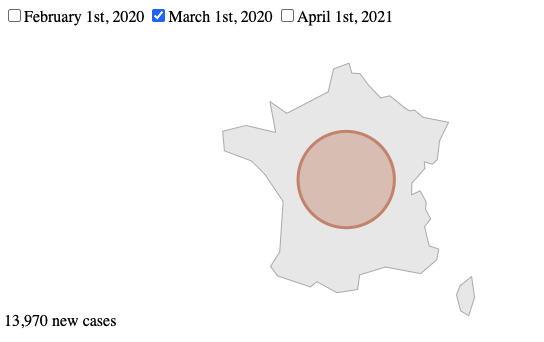
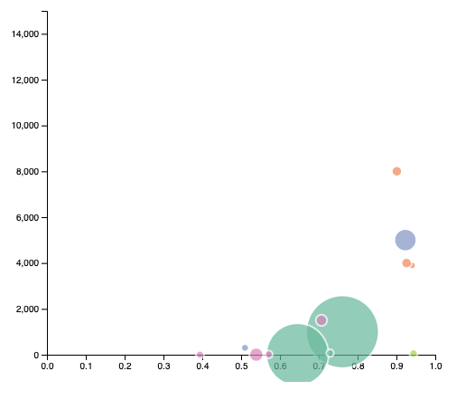
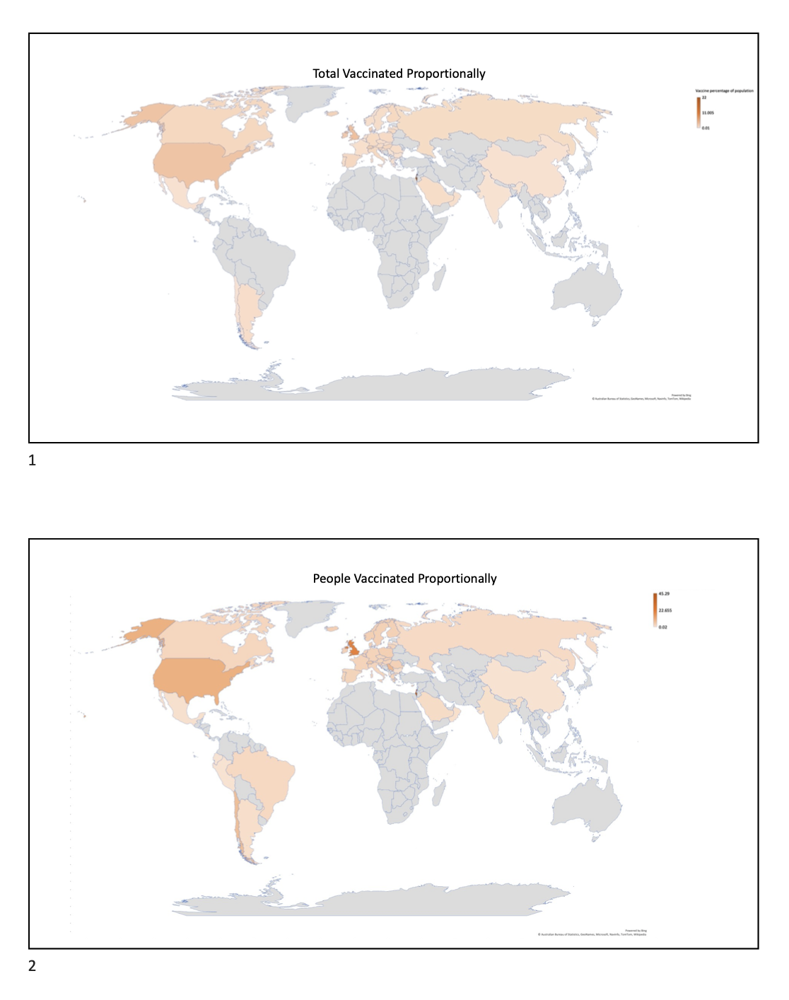
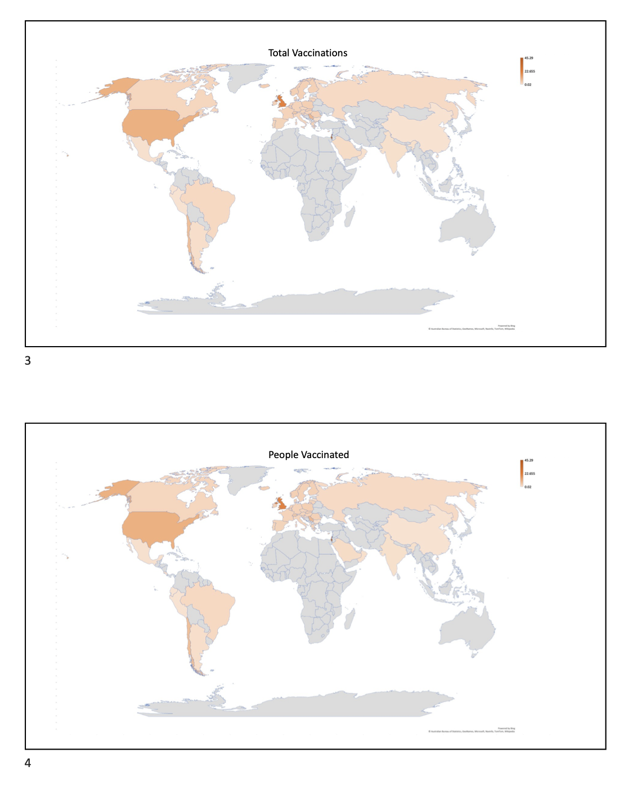
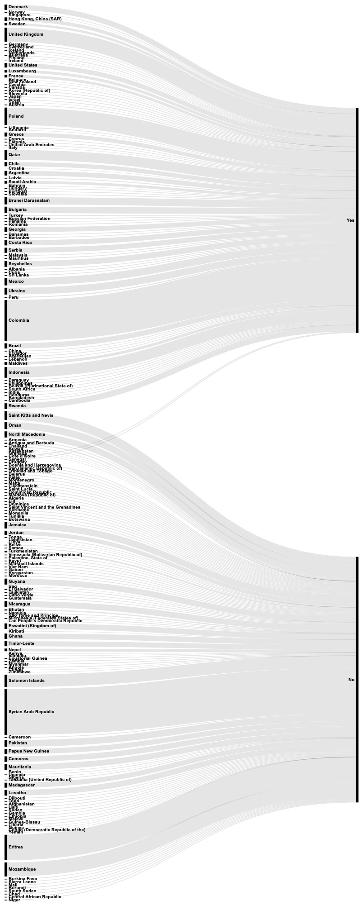

# Design process

The submitted coursework moved through three stages for each research question: sketching and precedent review, low-fidelity work in presentation/spreadsheet tools, and rapid D3 prototyping. This folder preserves the useful artefacts from those explorations without the duplicate exports, temporary Office files or IDE metadata retained in the local archive.

## Design 1 - global spread over time

An interactive bubble-map concept explored how users might compare case volumes across dates and inspect individual countries.

- [`prototype.html`](design-1-bubble-map/prototype.html) - D3 bubble-map experiment
- [`concept.pdf`](design-1-bubble-map/concept.pdf) - initial visual concept
- [`data.csv`](design-1-bubble-map/data.csv) - supporting vaccination data export

## Design 2 - development and COVID-19 outcomes

A bubble scatterplot considered relationships between Human Development Index, deaths, population and continent.

- [`prototype.html`](design-2-hdi-scatterplot/prototype.html) - runnable D3 scatterplot
- [`concept.pdf`](design-2-hdi-scatterplot/concept.pdf) - design rationale visual
- [`data.csv`](design-2-hdi-scatterplot/data.csv) - prototype data

## Design 3 - global vaccination rollout

The choropleth concept developed into the final implementation. These wireframes show the intended map, selectable measures and supporting country comparisons.

- [`concept.pdf`](design-3-vaccination-choropleth/concept.pdf) - visual design exploration
- [`data.csv`](design-3-vaccination-choropleth/data.csv) - HDI/vaccination concept data

## Design 4 - vaccine inequality

A Sankey prototype explored whether flow width and HDI ordering could make unequal vaccine access visible. It remained an exploratory design rather than becoming part of the final dashboard.

- [`prototype.html`](design-4-hdi-sankey/prototype.html) - runnable D3 Sankey experiment
- [`sankey.js`](design-4-hdi-sankey/sankey.js) - archived Sankey layout implementation
- [`data.csv`](design-4-hdi-sankey/data.csv) - prototype data

The full rationale, strengths and limitations of each direction are documented in the [submitted project report](../docs/KCL-COVID-19-Data-Visualisation-Report.pdf).
